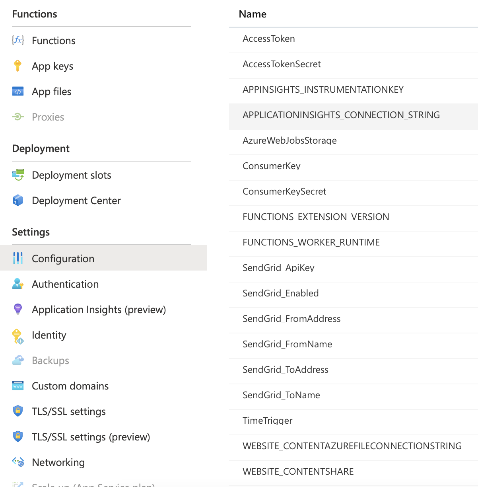

# Sensor Battery Checker for Telldus Live (Azure Function)

This is a Azure Function that polls your sensors through Telldus Live and checks if they have too low battery level.
If they have too low battery, you will recive a mail.

## Getting started

This guide briefly describes how you run this solution locally on your machine and how to deploy it to Azure.

### Configure SendGrid account

This solution uses [SendGrid](https://app.sendgrid.com) to send mail notifications when an error occur.

You need to setup an API key and a Sender Authentication. The Sender Authentication must match the configuration in this solution.

The mailer functionality is disable by default, enable by setting the `SendGrid_Enabled` configuration to true.

### Local development

When working locally, you need to configure `local.settings.json`. That file is only used for local development. In the cloud the app is reading from environment variables.

### Deploy to Azure

- Create a new Function App that you can deploy to by reading [this guide](https://docs.microsoft.com/en-us/azure/azure-functions/functions-create-your-first-function-visual-studio)
- Open the solution file in Visual Studio, right-click on the SensorBatteryChecker project and select Publish > Publish to Azure...
- Sign in to Azure and select your newly created Function App.
- Configure environment variables (SendGrid not enabled in this image):
  
- Restart your Function App from the Overview page.

Want to take your development to the next level? Create the function app through ARM templates and deploy through CI/CD pipelines.
# FAQ

## macOS
When developing in macOS you might get the following error:

```console
Retrying to start listener for function 'SensorBatteryChecker' (Attempt 5)
The listener for function 'SensorBatteryChecker' was unable to start.
The listener for function 'SensorBatteryChecker' was unable to start. Microsoft.Azure.Storage.Common: Connection refused. System.Net.Http: Connection refused. System.Private.CoreLib: Connection refused.
```

The solution is to start azurite storage emulator by typing:

```shell
sudo apt-get install npm
sudo npm install -g azurite
azurite
```
